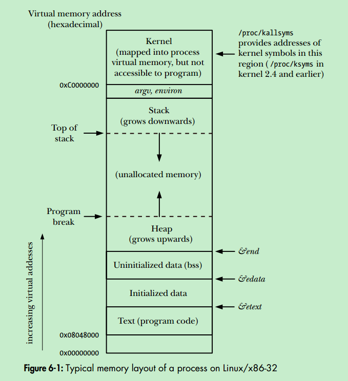
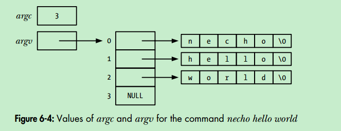
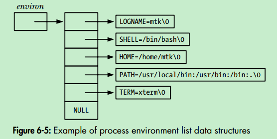

# The Linux Programming Interface: A Linux and UNIX System Programming Handbook [Chapter 6: Process]

---

## 6.1 Process and Programs
>* **A process is an instance of an executing program.**
>* **A program is a file containing a range of information that describes how to construct a process at run time.**


program含有如下的信息:
> * **binary format identification:**
   * **a.out** (Assembler output), 
   * **COFF** (Common Object File Format)
   * **ELF** (Executable and Linking Format) [More formats](https://en.wikipedia.org/wiki/Comparison_of_executable_file_formats)
> * **Machine-language instructions:**
> * **Program entry point address:**
> * **Symbol and relocation tables:**
> * **Shared library and dynamic-linking information**
> * **Other information**

 用readelf查看program的信息：`readelf -h atomic_unittest`
```
ELF Header:
  Magic:   7f 45 4c 46 02 01 01 00 00 00 00 00 00 00 00 00 
  Class:                             ELF64
  Data:                              2's complement, little endian
  Version:                           1 (current)
  OS/ABI:                            UNIX - System V
  ABI Version:                       0
  Type:                              EXEC (Executable file)
  Machine:                           Advanced Micro Devices X86-64
  Version:                           0x1
  Entry point address:               0x400680
  Start of program headers:          64 (bytes into file)
  Start of section headers:          10216 (bytes into file)
  Flags:                             0x0
  Size of this header:               64 (bytes)
  Size of program headers:           56 (bytes)
  Number of program headers:         8
  Size of section headers:           64 (bytes)
  Number of section headers:         36
  Section header string table index: 33
```

## 6.2 Process ID and Parent Process ID

* 程序中获取Process ID
```c
#include <unistd.h>
pid_t getpid(); //get process id
```

* Process ID Limit 最大值可以通过 **/proc/sys/kernel/pid_max**文件来查看/调整, 文件中的值为limit的**最大值+1**。Process ID默认最大值为32767 = 0x7FFFFFFF，故默认情况下**/proc/sys/kernel/pid_max**中的值是32768。

* 每个进程都有父进程，除了**init**进程。
```c
#include <unistd.h>
pid_t getppid(); //get parent's process id
```
如果某个进程A的父进程terminate了，那么进程A就会被**init**进程收养。此后进程A执行getppid得到的值是1，即**init**进程的PID。 

* 任意进程的父进程ID可以通过**/proc/`PID`/status**中的PPid字段得知。

## 6.3 Memory Layout of a Process

### **6.3.1 Memory Layout**

> * text segment
特点：**read-only**，防止bad pointer意外篡改代码段内容； **sharable**，多个process可以共享。
> * initialized data segment
存储初始化过的全局变量以及static变量
> * uninitialized data segment
存储未初始化过的全局变量以及static变量
> * stack
> * heap



---
>**Q**. 既然initialized data segment和uninitialized data segment都是存储全局变量和static变量的地方，为何还要区分出这两种？

>**A**. 之所以要对上面两种做出区分是因为前者需要在program file中就分配空间来存储初始化的值，即要存储在disk上。而后者真正的空间的分配是当program被运行，被program loader从disk中装载到内存中进行运行的时候才会进行。

---

`size`可以用来查看program的**initialized data segment(data)**, **uninitialized data segment(bss)**, **text segment**的大小：
> `size atomic_unittest`
```
   text	   data	    bss	    dec	    hex	filename
   1806	    600	      8	   2414	    96e	atomic_unittest
```
**dec**和**hex**分别是这三个segment大小总和的10进制和16进制表示。

libc中有全局变量可供查询text, data, bss段的结束地址**etext, edata, end**，可以`man etext`, `man edata`, `man end`查看manual。

```c
#include <stdio.h>
#include <stdlib.h>

extern char etext, edata, end; /* The symbols must have some type,
								  or "gcc -Wall" complains */

int
main(int argc, char *argv[])
{
   printf("First address past:\n");
   printf("    program text (etext)      %10p\n", &etext);
   printf("    initialized data (edata)  %10p\n", &edata);
   printf("    uninitialized data (end)  %10p\n", &end);

   exit(EXIT_SUCCESS);
}
```

> First address past:
    program text (etext)        0x40073d
    initialized data (edata)    0x600b70
    uninitialized data (end)    0x600b78
### **6.3.2 Virtual Memory Management**
* virtual memory scheme splits the memory used by each program into small fixed-size units called **pages**. 
分页

* At any one time, only some of the pages of a program need to be resident in physical memory page frames; these pages form the so-called **resident set**. 
对应于`top`中的RSS，即**resident set size**。

* Copies of the unused pages of a program are maintained in the **swap area**—a reserved area of disk space used to supplement the computer’s RAM—and loaded into physical memory only as required. When a process references a page that is not currently resident in physical memory, a **page fault** occurs, **at which point the kernel suspends execution of the process while the page is loaded from disk into memory**.

* kernel为每个进程维护一个**page table**，含有所有virtual memory address space中 **有效的** （即那些vma space中根本没有用到的那些page根本不需要存在于page table中） page与存在于physical memory中的位置，或者标识其不在physical memory中。

* 如果进程访问的地址所在的page根本不存在于page table中，则进程收到一个**SIGSEGV**信号。

* 采用virtual memory management的好处：
 * 进程间隔离，即A进程不能访问、修改B进程的内存（通过将两者在各自page table中的entry指向不同的physical memory的page来实现）
 * 但是在需要进程间能共享内存的时候，又可以通过将各自的page table entry指向同一个physical memory page来实现，通常有两种情况需要这么做：
 >* Multiple processes executing the same program can share a single (readonly) copy of the program code. This type of sharing is performed implicitly when multiple programs execute the same program file (or load the same shared library).
 >* Processes can use the shmget() and mmap() system calls to explicitly request sharing of memory regions with other processes. This is done for the purpose of interprocess communication.

 * 通过page table来控制不同进程对于同一块物理内存的访问权限
 * 通过换入换出机制可以让进程的virtual size超过物理内存的实际容量

## 6.5 The Stack and Stack Frames
Each **user stack frame** contains the following information:
 >* function arguments and local variables
 >* call linkage information
 即context，如各个寄存器的值
 
## 6.6 Command-Line Arguments(argc, argv)


* 可以利用argv[0]是被invoke的程序的name这一特性来实现一个小trick：
 >We can create multiple links to (i.e., names for) the same program, and then have the program look at argv[0] and take different actions depending on the name used to invoke it. An example of this technique is provided by the gzip(1), gunzip(1), and zcat(1) commands, all of which are links to the same executable file. 
 
* argc，argv是main函数中传递进来的参数，要想在别的地方用得将值传递到全局变量里
* 或者：**/proc/`PID`/cmdline**文件中有记录，如果自己进程想访问自己的cmdline记录就访问**/proc/self/cmdline**
* 关于argv数组和environ数组的存放位置在栈底之下（即栈增长的反方向），这个区域的大小是有限制的，可以用sysconf来获取
```
sysconf(_SC_ARG_MAX)
```

##6.7 Environment List
* 每个进程都有一个关联的array of strings，称为**environment list**，每个都是以**name=value**的形式存在
* 当子进程被父进程创建的时候，子进程也会继承父进程的**environment list**，这也是一种`interprocess-communication`
* 子进程创建后，父进程或者子进程可以分别修改自己的**environment list**，对方无法知晓
* shell都可以方便的修改其environment list，比如：
` $ export PATH=/home/bin`
执行后，由这个shell invoke出来的进程（即这个shell进程的子进程）都会继承环境变量$PATH为/home/bin
* `env`这个gnu core utility程序可以以修改后的环境变量来运行某个程序，详见`man env`
* `printenv`可以打印出当前进程的环境变量
* 任意进程的环境变量列表可以由 **/proc/`PID`/environ** 文件查看

### Accessing the environment from a program
通过全局变量来访问环境变量列表
```c 
char **environ
```


或者通过getenv函数来获取指定名字的环境变量
```c
#include <stdlib.h>
char *getenv(const char *name);
```
由于putenv(), setenv(), unsetenv()等函数会改变process的环境变量，所以getenv()得到的值最好保存到一个单独的地方，防止多次调用getenv()的时候得到的结果不一样。

### Modifying the environment
为什么要修改环境变量呢？因为这可以作为一种`interprocess communication`的手段，甚至是`inter-program communication`的手段（即父进程修改环境变量，然后fork出子进程，然后子进程通过`exec()`来换身成另外一个程序，所以称为`inter-program`）

```c
#include <stdlib.h>
int putenv(char *string);
```

**注意**
1. string的形式是*name=value*
2. string指向的字符串一定不能是automatic variable
> The string argument is a pointer to a string of the form name=value. After the putenv() call, this string is part of the environment. In other words, rather than duplicating the string pointed to by string, **one of the elements of environ will be set to point to the same location as string**. Therefore, if we subsequently modify the bytes pointed to by string, that change will affect the process environment. 


```c
#include <stdlib.h>
int setenv(const char *name, const char *value, int overwrite);
```
setenv则不同于putenv，自己会分配一块空间来copy你设置的name和value，然后让全局变量`environ`指向分配的空间

###Unset and erase the environment

* 清除某一个环境变量
```c
int unsetenv(const char *name);
```

* 清空所有环境变量
```c
int clearenv(void);
```
或者
```c
environ = NULL;
```


 
 
 
 
 
 
 
 
 
 
 
 
 
 
 
 
 
 
 
 
 
 
 
 
 
 
 
 
 