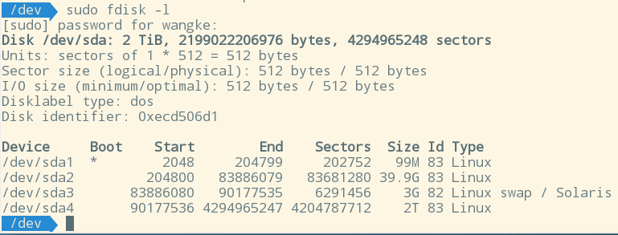
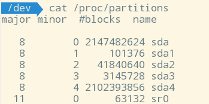
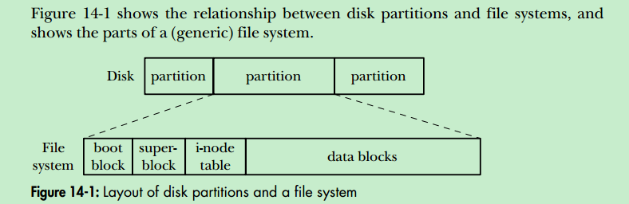
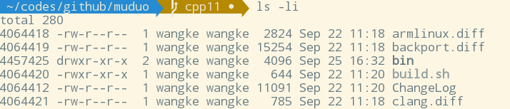
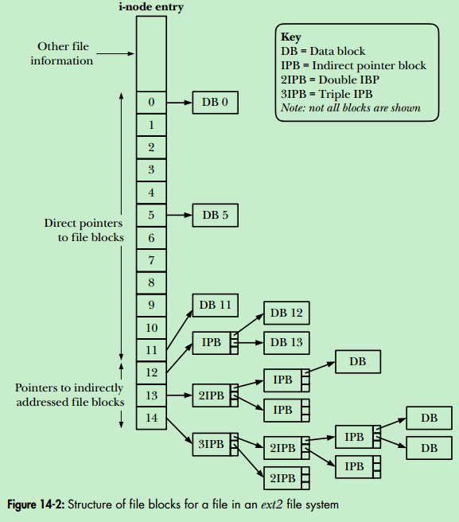
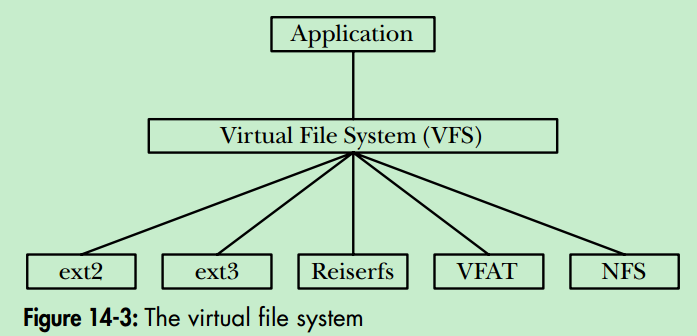
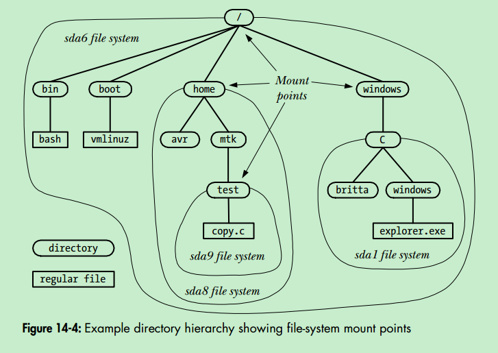
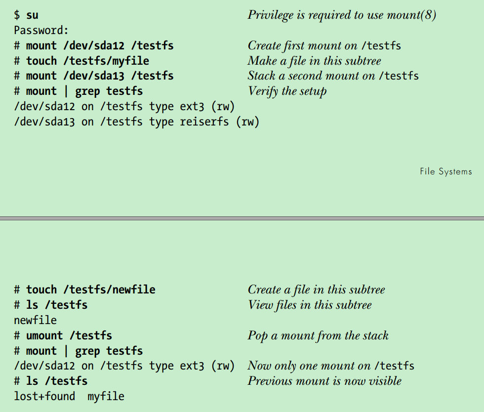
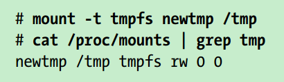

#Linux Programming Interface Chapter 14: File System

##14.1 Device Special Files (Devices)
一个device special file对应一个device。
每种device都在kernel中对应有device driver。
device driver是代码，它提供的API是固定的，对应于system call：
`open(), close(), read(), write(), mmap(), and ioctl()`

> The fact that each device driver provides a consistent interface, hiding the differences in operation of individual devices, allows for universality of I/O

有的device是真实存在的，比如mice, disks, tape drives；
有的device是虚拟（virtual）的，没有对应的硬件设备（尽管kenrel也为这些虚拟的device提供操作它们的API，即device driver）

device分为两类:
* charater device : handle data on a charater-by-character basis
比如 `terminals` `keyboards` 
* block device : handle data a block at a time
比如 `disks` `tape drive`![enter image description here][1]

device file和其它file一样，存在file system中，通常是在**`/dev`** 目录下

###Device IDs
每个设备文件有个 `major ID number` 和 `minor ID number`
`major ID number` 标识设备的类别(general class)，kernel用这个ID去找对应的device driver
`minor ID number` 标识该类别内的某一个设备，区别于同类别的其它设备
`ls -l`可以显示major ID和minor ID number

 major ID number是固定分配好的，见 http://www.lanana.org/
 
##14.2 Disks and Partitions

###Disk drives
###Disk partitions
* disk被分为一个或多个nonoverlapping partition
* 每个partition被kernel视为一个单独的device，位于`/dev`下

`fdisk -l`列出所有partitions



`/proc/partitoins`列出major/minor ID number等信息


创建swap：`mkswap(8)`
打开关闭swap空间的system call：`swapon()` `swapoff()`

##14.3 File Systems
创建文件系统: `mksf` command

The file-system types **`currently known by the kernel`** can be viewed in the Linux-specific `/proc/filesystems` file

>Linux 2.6.14 added the Filesystem in Userspace (FUSE) facility. This mechanism adds hooks to the kernel that **allow a file system to be completely implemented via a user-space program, without needing to patch or recompile the kernel**. For further details, see http://fuse.sourceforge.net/.  

###The ext2 file system
> The ext2 file system was written by Remy Card. The source code for ext2 is small (around 5000 lines of C) and forms the model for several other file-system implementations. The ext2 home page is http://e2fsprogs.sourceforge.net/ext2.html. This web site includes a good overview paper describing the implementation of ext2. The Linux Kernel, an online book by David Rusling available at http:// www.tldp.org/, also describes ext2.  

###File-system structure
file system中分配一块空间的最小单位是一个 `logical block`
logical block是 `physical block`的整数倍，比如4096 bytes
logical block的大小是在`mkfs`的时候设置的



* **boot block**
虽然操作系统只需要一个boot block，但是所有的file system上都有一块boot block（尽管它们大多都没被用到）
* **superblock**
记录了一些管理信息，比如i-node table大小, logical block大小，整个file system的大小等
* **i-node talbe**
* **data blocks**

**Extend Reading**
>In the specific case of the ext2 file system, the picture is somewhat more complex than described in the main text. After the initial boot block, the file system is broken into a set of equal-sized block groups. Each block group contains a copy of the superblock, parameter information about the block group, and then the i-node table and data blocks for this block group. By attempting to store all of the blocks of a file within the same block group, the ext2 file system aims to reduce seek time when sequentially accessing a file. For further information, see the Linux source code file Documentation/filesystems/ext2.txt, the source code of the dumpe2fs program that comes as part of the e2fsprogs package, and [Bovet & Cesati, 2005].  

##14.4 i-nodes
* 每个文件都对应一个i-node于i-node table中
* i-node number就是每个i-node在i-node table中的位置
* i-node number可以用ls -li的第一个字段看到


每个i-node节点包含以下信息:
* file type(e.g., regular file, directory, symbolic link, character device)
* owner (UID)
* group (GID)
* access permissions (rwx)
* three timestamps
 * time of last access to the file (shown by `ls -lu`)
 * time of last modification to the file (default time shown by `ls -l`)
 * time of last status change (last change to i-node information shown by `ls -lc`)
* number of hard links to the file
* size of file in bytes
* number of blocks actually allocated to the file measured in units of 512byte blocks
**注意，这个值和文件的size in bytes之间未必有直接关系，因为一个file可以有hole，因此这个值乘以512的bytes肯定要小于文件的size**
* **pointers to the data blocks of the file**

###I-nodes and data block pointers in ext2


##14.5 The Virtual File System(VFS)
尽管不同的file system有着不同的实现，但是提供统一的接口。
VFS接口提供常用的system call如：
`open(), read(), write(), lseek(), close(), truncate(), stat(), mount(), umount(), mmap(), mkdir(), link(), unlink(), symlink(), and rename(). `

有的file system并不支持VFS对外提供的一些接口，比如Microsft's VFAT file system不提供symbolic link的概念，那么在Linux系统上执行symlink()系统调用则会返回错误码。


##14.6 Journaling File Systems
* ext2的一个缺陷就是：当system crash后，重启的时候必须进行`file-system integrity check(fsck)`，因为crash的时候，a file update可能只完成了一部分，而且file-system metadata（比如目录，i-node信息，file data block pointers）可能处于一个inconsistent state，如果这种不一致性没有得到修复而继续进行读写，可能会导致更多更大的错误。`fsck`的过程就是保证发现这些不一致，并且尝试修复，修复不了就丢弃部分数据。
* fsck由于需要扫描整个file system，因此耗时很长，对于有high availability要求的系统来说显然是不合适的。
* Journaling file system就是来解决这些问题的。在执行一个file update之前，它记录下所有的metadata update，保存到磁盘上的一个特殊的文件中，这样如果系统crash重启，则journaling file system通过这个文件就可以恢复metadata

> Some journaling file systems ensure only the consistency of file metadata. Because they don’t log file data, data may still be lost in the event of a crash. The ext3, ext4, and Reiserfs file systems provide options for logging data updates, but, depending on the workload, this may result in lower file I/O performance.  

##4.7 Single Directory Hierarchy and Mount Points

不同的目录下可能是不同的file system

`$ mount device directory`



##14.8 Mounting and Unmounting File Systems

与mounted file systems有关的有三个文件：
* currently mounted file systems: `/proc/mounts`
/proc/mounts is **an interface to kernel data structures, so it always contains accurate information** about mounted file systems

* /etc/mtab
The mount(8) and umount(8) commands automatically maintain the file /etc/mtab, which contains information that is similar to that in /proc/mounts, but slightly more detailed. In particular, /etc/mtab includes file system–specific options given to mount(8), which are not shown in /proc/mounts. However, because the mount() and umount() system calls don’t update /etc/mtab, this file may be inaccurate if some application that mounts or unmounts devices fails to update it. 

* /etc/fstab 
maintained manually by the system administrator, contains descriptions of all of the available file systems on a system, and is used by the mount(8), umount(8), and fsck(8) commands 

三个文件里内容的格式是一致的，可见 mannual `fstab(5)`
比如：`/dev/sda9 /boot ext3 rw 0 0`
1. mounted device
2. mount point
3. file-system type
4. mount flags
5. A number used to control the operation of file-system backups by dump(8).
This field and the next are used only in the /etc/fstab file; for /proc/mounts
and /etc/mtab, these fields are always 0.
6. A number used to control the order in which fsck(8) checks file systems at system boot time.

这些文件里的entry可以由系统调用 `getfsent(3)` 和 `getmntent(3)`获取

###14.8.1 Mounting a File System: mount()

```c
#include <sys/mount.h>
int mount(const char *source, const char *target, const char *fstype,
unsigned long mountflags, const void *data);
```

详见manual.

###14.8.2 Unmounting a File System: umount() and umount2()
```c
#include <sys/mount.h>
int umount(const char *target);
int umount2(const char *target, int flags);
```
详见manual

##14.9 Advanced Mount Features

###14.9.1 Mounting a File System at Multiple Mount Points
a file system can be mounted at multiple locations within the file system. Because each of the mount points shows the same subtree, changes made via one mount point are visible through the other(s) 

###14.9.2 Stacking Multiple Mounts on the Same Mount Point
Since kernel 2.4, Linux allows multiple mounts to be stacked on a single mount point. Each new mount hides the directory subtree previously visible at that mount point. When the mount at the top of the stack is unmounted, the previously hidden mount becomes visible once more, as demonstrated by the following shell session:   



###14.9.3 Mount Flags That Are Per-Mount Options
to be added
###14.9.4 Bind Mounts
to be added
###14.9.5 Recursive Bind Mounts
to be added

###14.10 A Virtual Memory File System: tmpfs
`tmpfs`这种file system的空间是配置在RAM上的。
创建一个tmpfs文件系统: 
`# mount -t tmpfs source target`
source 随便填，只是为了显示在`/proc/mounts`中，或者是`mount`命令，或者是`df`命令
target就是mounting point
该命令无需手动执行`mkfs`去创建一个文件系统，因为执行`mount`的时候会自动创建一个tmpfs类型的file system


As an example of the use of tmpfs, we could employ mount stacking (so that we don’t need to care if /tmp is already in use) and create a tmpfs file system mounted on /tmp as follows: 

这种用法通常是为了提高一些应用程序的性能，因为有的应用程序会再`/tmp`目录下创建一些临时文件，比如compiler.

**tmpfs file system有两点重要的应用**
* a invisible `tmpfs` file system由kernel进行mount，用于实现System V shared memory以及shared anonymous memory mappings
* a `tmpfs` file system mounted at `/dev/shm` 别用于`glibc`的POSIX shared memory 和POSIX semaphores的实现

###14.11 Obtaining Information About a File System: statvfs()
```c
#include <sys/statvfs.h>
int statvfs(const char *pathname, struct statvfs *statvfsbuf);
int fstatvfs(int fd, struct statvfs *statvfsbuf);

struct statvfs {
unsigned long f_bsize; /* File-system block size (in bytes) */
unsigned long f_frsize; /* Fundamental file-system block size
(in bytes) */
fsblkcnt_t f_blocks; /* Total number of blocks in file
system (in units of 'f_frsize') */
fsblkcnt_t f_bfree; /* Total number of free blocks */
fsblkcnt_t f_bavail; /* Number of free blocks available to
unprivileged process */
fsfilcnt_t f_files; /* Total number of i-nodes */
fsfilcnt_t f_ffree; /* Total number of free i-nodes */
fsfilcnt_t f_favail; /* Number of i-nodes available to unprivileged
process (set to 'f_ffree' on Linux) */
unsigned long f_fsid; /* File-system ID */
unsigned long f_flag; /* Mount flags */
unsigned long f_namemax; /* Maximum length of filenames on
this file system */
};

```

*pathname*和*fd*用来指定某个file system上的任意一个文件
详见manual


